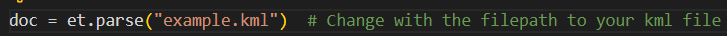

# KMLDataExtractor

<!-- <div>
    <div align="center">
        
    </div>
<br> -->

[](https://www.codefactor.io/repository/github/panagiotis-sklidas/kmldataextractor)

</div>

<!-- Contents -->
# Contents

- [About the Project](#about-the-project)
  * [Features](#features)
- [Getting Started](#getting-started)
  * [Prerequisites](#prerequisites)
  <!-- * [Run locally](#run-locally) -->
  * [Usage](#usage)
- [License](#license)
- [Acknowledgements](#acknowledgements)

<!-- About the Project -->
## About the Project
This project was created during my studies at the University for the course "Optimization Algorithms". The final assignment required us to use optimization algorithms to find a solution to a similar postman problem with coordinates from a KML file. This Python script can export the placemarks' names and coordinates (latitude and longitude) to a CSV file as well as convert the latitude and longitude to x, y, and z coordinates, creating a second CSV file with them.

<!-- Features -->
### Features
 * Exports a CSV file named rawcoordinates, which has all placemarks name and their latitude, longitude, and altitude coordinates
 * Exports a CSV file named coordinates, which has all placemarks names, their x, y, and z coordinates

 <!-- #### Curenntly working on:
 * Make the script run as a terminal app -->

<!-- Getting Started -->
## Getting Started

<!-- Prerequisites -->
### Prerequisites

To run the application locally, you should have the following installed:
* Python 3.9.6 (Download [here](https://www.python.org/downloads/release/python-396/))
* defusedxml module
```
pip install defusedxml
```

<!-- Run Locally
### Run Locally
1. In your IDE, change the filepath of the doc variable to show your KML file.
<div>
  
</div>

2. Then run and let the script extract and create the CSV files with the latitude and longitude and x,y,z coordinates. -->

<!-- Usage -->
## Usage
1. Download the Python file (extractData.py) and add it to the folder where your KML file is (or not)
2. In your terminal window, move to where you downloaded the extractData.py
3. Then run the following command:
```
python extractData.py "example.kml"   
```
4. The script will extract and create the CSV files with the latitude and longitude and x,y,z coordinates.<br><br>

<strong>Notes!</strong>
* To add full fillpath, for example,e if the KML file is on your Desktop, the command should look like this:
```
python extractData.py "C:\Users\User\Desktop\example.kml"
```
* The CSV files will be located in the same folder as the extractData.py file
* The default namespace is: http://www.opengis.net/kml/2.2, but if you want to use another, then you can use the -n/--namespace flag. The command with -n flag looks like this:
```
python extractData.py "C:\Users\User\Desktop\example.kml" -n "http://www.opengis.net/kml/2.2"
```

<!-- License -->
## License
See [LICENSE](https://github.com/Panagiotis-Sklidas/KMLDataExtractor/blob/main/LICENSE)

<!-- Acknowledgments-->
## Acknowledgements
SUBJECT AREA: Optimization Algorithms
<br>
KEYWORDS: Python, KML, Data extraction, Transform coordinates to xyz
